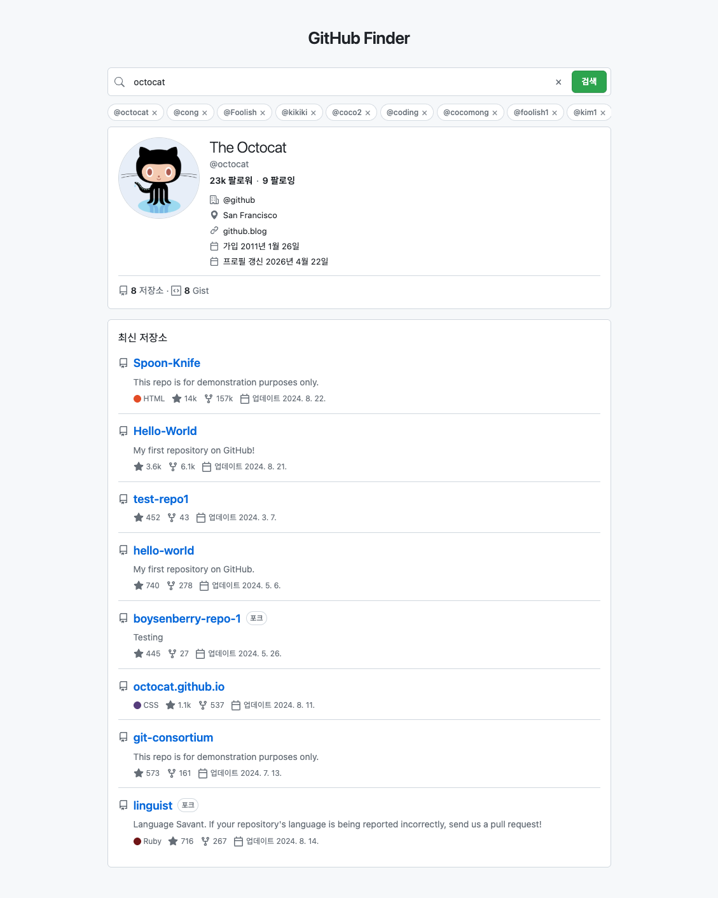

# GitHub Finder

- **목적**: GitHub 공개 REST API(비인증)로 사용자 프로필과 최신 공개 저장소 10개를 조회하는 정적 페이지
- **구성**: HTML · CSS · [`js/`](js/) 스크립트(클래스 기반 · ES 모듈·번들러 없음)
- **UI**: GitHub.com 프로필에 가까운 톤(라이트/다크 · Octicons 스타일 SVG 스프라이트 · vcard형 정보 줄)

> GitHub 웹의 **프로필·저장소** 화면을 참고해 색·타이포·아이콘·여백이 **익숙한 톤**으로 보이도록 맞추는 데 무게를 두었습니다. Primer·Octicons나 공식 UI와 **완전히 동일한 복제**를 목표로 하지는 않습니다.

## 1. 기능

| 영역 | 내용 |
|------|------|
| 검색 | 로그인과 동일한 사용자명 · Enter 또는 검색 버튼 · 돋보기(SVG 스프라이트) · 플레이스홀더 `사용자명 입력 (ex. octocat)` · 입력 지우기(×, 값 있을 때만 표시) |
| 최근 검색 | 성공한 조회만 로컬스토리지 최대 10건 · 칩 UI · 칩 클릭 재검색 · 항목별 × 삭제<br>가로 넘침: 스크롤바 숨김 · 마우스·펜 드래그·손 뗀 뒤 관성 · 터치는 기본 가로 스크롤(`touch-action: pan-x`) |
| 초기 화면 | 검색 전 프로필은 안내문만(`#profile-empty-hint`) · 저장소는 idle 안내(테두리 없는 플레이스홀더) |
| 스켈레톤 UI | 검색 직후·응답 대기 중에만 프로필 패널에 표시(`data-state="loading"`) · 아바타 자리 원형·이름·메타 막대 쉬머 · 실제 프로필·스켈레톤·에러 블록은 상태별로 한 블록만 노출 · 원형 아바타 자리는 테두리 없음 |
| 프로필 | 아바타 · 표시 이름 · @로그인(`html_url`, 작은 글씨·호버 톤) · `bio`는 값 있을 때만 |
| 404 | 사용자 없음: 작은 글씨·`--fg-muted` · 그 외 프로필 오류는 위험색 |
| 팔로워·팔로잉 | 이름 아래 한 줄 · `formatGhCount` · GitHub 팔로워/팔로잉 탭 링크 |
| vcard (`#profile-vcard`) | 소속·위치·웹·메일·X·가입·갱신일 · 아이콘+한 리스트 · 값 있는 항목만 · 없으면 블록 숨김 |
| 통계 (`#stats-row`) | 공개 저장소 수 · 공개 Gist 수 · 아이콘 `repo` / `code-square` |
| 저장소 목록 | 업데이트 순 최대 10건 · 새 탭(`noopener noreferrer`) · 아이콘+이름 · 포크 뱃지 · 설명·언어(`LANG_COLOR`)·스타·포크·업데이트일은 데이터 있을 때만 · `formatGhCount` · idle 안내는 작은 글씨·`--fg-muted` |
| 오류·로딩 | 빈 입력·404·403·네트워크 한국어 안내 · 403 시 가능하면 `X-RateLimit-Remaining` 반영 |
| 이메일 | 비인증 API `email`은 대부분 `null` — 웹과 불일치 가능([docs/ui-troubleshooting.md](docs/ui-troubleshooting.md)) |

## 2. 검색 한 번에 API가 두 번 호출되는 이유

- **분리 엔드포인트**: 사용자 정보와 저장소 목록을 한 URL로 묶어 주지 않음
- **호출 순서**: `GET /users/{login}`(사용자) → `GET /users/{login}/repos?...`(저장소, `sort=updated` 등)
- **404**: 사용자가 없으면 두 번째 호출은 하지 않음

## 3. 비인증 API 한도

- **대략**: IP 기준 시간당 약 60회 수준으로 이해하면 됨
- **상세**: [Rate limits for the REST API](https://docs.github.com/en/rest/using-the-rest-api/rate-limits-for-the-rest-api)

## 4. 로컬에서 실행하는 방법

- **`file://`**: `index.html`만 열어도 동작하는 경우가 많음 · 환경에 따라 `fetch` 제한 가능 · `js/` 스크립트는 **`index.html`과 같은 폴더 기준**으로 `defer` 순서대로 로드(ES `import` 미사용)
- **권장**: 정적 서버로 서빙
- **예시** (`serve`):

```bash
cd /path/to/github-finder
npx --yes serve .
```

- **접속**: 터미널에 나온 `http://localhost:…` 로 브라우저에서 열기
- **대안**: `python3 -m http.server` 등 동일 역할의 정적 서버

## 5. 스크립트 구조 (OOP)

역할은 [`js/`](js/) 아래 파일로 나뉩니다. `index.html`에서 **아래 순서**로 `<script defer>` 로드합니다(전역 클래스·함수, 번들러 없음).

| 파일 | 주요 내용 |
|------|-----------|
| [`js/constants.js`](js/constants.js) | `MESSAGES`, `PLACEHOLDER_AVATAR`, 최근 검색 스토리지 키 |
| [`js/recent-search.js`](js/recent-search.js) | `RecentSearchStore`, `RecentSearchDragScroll` |
| [`js/format.js`](js/format.js) | `formatGhCount`, `LANG_COLOR`, `createIconUse` |
| [`js/api.js`](js/api.js) | `UrlSafety`, `GitHubClient` |
| [`js/view.js`](js/view.js) | `FinderView` |
| [`js/main.js`](js/main.js) | `GitHubFinderApp` · 진입 `init()` |

| 클래스 | 역할 |
|--------|------|
| `UrlSafety` | 외부 URL · `mailto` · 트위터 프로필 URL 검증(정적 메서드) |
| `GitHubClient` | GitHub REST 호출 · 한도 헤더 해석 |
| `RecentSearchStore` | 최근 로그인 로컬스토리지 읽기·추가·삭제(성공 시만 · 최대 10건) |
| `RecentSearchDragScroll` | `#search-recent-list`에 마우스·펜 가로 드래그·관성(터치는 네이티브 스크롤) |
| `FinderView` | `bind()`에서 검색·프로필·저장소 DOM 캐시 · vcard · 인라인 팔로워/팔로잉 · 통계 · 에러 · 빈 안내 · 저장소 목록·메타 · `formatGhCount` · `LANG_COLOR` |
| `GitHubFinderApp` | 폼 submit · 입력 · 지우기 · 최근 검색 칩 클릭 · 검색 흐름(`#runSearch`) · `AbortController` · `RecentSearchStore` · `RecentSearchDragScroll` 초기화 |

## 6. 프로젝트 구조

| 파일 | 설명 |
|------|------|
| `index.html` | 마크업 · SVG 스프라이트 · 검색·프로필·저장소 · `js/*.js` 6개 `defer` 순서 로드 |
| `styles.css` | 라이트/다크 변수 · 검색 · 최근 검색 · 프로필 · 저장소 · 반응형 |
| `js/constants.js` | 공통 메시지·아바타 placeholder·로컬스토리지 키 |
| `js/recent-search.js` | 최근 검색 저장·칩 드래그 스크롤 |
| `js/format.js` | 숫자 축약·언어 색·Octicon `use` 헬퍼 |
| `js/api.js` | URL 검증·GitHub REST |
| `js/view.js` | DOM 렌더링(`FinderView`) |
| `js/main.js` | 앱 컨트롤러(`GitHubFinderApp`) |
| `screencapture.png` | README **9. 배포 및 화면 캡쳐** 절에서 참조 |
| `PLAN.md` | 개발 계획(범위 · Must/Nice) |
| `AGENTS.md` | 작업 이력 한 줄 요약 |
| `docs/prompt-log.md` | 프롬프트 · 의도/반영 로그 |
| `docs/ui-troubleshooting.md` | UI 개편 · 증상별 안내 · **2.**~**9.** 절 트러블 · **10.** 참고 링크 |

## 7. 문서

- **계획**: [PLAN.md](PLAN.md) — 기능 · API · 스택 · 범위
- **프롬프트 로그**: [docs/prompt-log.md](docs/prompt-log.md) — 요청 · 의도 정리
- **UI 트러블슈팅**: [docs/ui-troubleshooting.md](docs/ui-troubleshooting.md) — 아이콘 · vcard · 이메일 API · 빈 필드 · 타이포 · 통합 상태 UI · 최근 검색 드래그 등(본 문서 **2.**~**9.** 절 형식은 프롬프트 로그와 동일)

## 8. 개발 회고록

GitHub 웹 프로필·저장소 화면의 톤이 마음에 들어, 아이콘(Octicons 스타일 스프라이트)·폰트 크기·여백 등을 비슷하게 맞추는 데 시간을 들였습니다. 검색 입력 흐름도 손에 익게 다듬었고, 같은 사용자명을 반복 입력하는 부담을 줄이기 위해 예전에 익힌 로컬 스토리지 패턴을 그대로 살려 **성공한 조회만** 최근 검색 칩으로 모아 두고, 한 번 탭하면 다시 검색되도록 구성했습니다.

최근 검색 칩 줄에서는 트러블슈팅이 특히 많았습니다. 처음에는 가로 스크롤바가 보이는게 어색해서 스크롤바를 숨기고 마우스로 드래그해 이동하는 방식으로 바꿨습니다. 그런데 드래그가 **칩 사이의 빈 공간**에서만 잡혀 사용하기 불편한 것을 발견했고, **칩 위에서도** 드래그되게 영역을 넓혔습니다. 이번에는 칩 클릭(재검색)과 × 삭제가 먹지 않는 현상이 생겼습니다. 원인은 `pointerdown` 이후 스크롤을 처리하는 쪽과 버튼의 `click`이 한 제스처 안에서 충돌하는 전형적인 케이스였고, **가로로 일정 거리 이상 움직였을 때만** “드래그로 간주”하는 임계값과, 드래그로 끝난 뒤 **불필요한 클릭 한 번을 삼키는** 처리로 둘 다 살리도록 조율했습니다.

이 과정에서 포인터 이벤트가 겹칠 때(스크롤 vs 클릭) 순서와 플래그로 흐름을 나누는 패턴을 코드로 정리할 수 있어 의미 있었습니다.

아래는 [`js/recent-search.js`](js/recent-search.js)의 `RecentSearchDragScroll` 핵심 로직입니다.

```javascript
const RECENT_DRAG_COMMIT_PX = 10;

// — pointermove: “드래그로 확정”되기 전에는 스크롤하지 않고, 가로 임계·대각(가로 우선)만 검사
if (!this._dragCommitted) {
  if (
    Math.abs(dx) >= RECENT_DRAG_COMMIT_PX &&
    Math.abs(dx) >= Math.abs(dy) * 0.55
  ) {
    this._dragCommitted = true;
    this.el.classList.add("search-recent__list--dragging");
    this._samples = [{ t: performance.now(), x: e.clientX }];
  } else {
    return;
  }
}
this.el.scrollLeft = this._startScrollLeft - dx;

// — pointerup: 실제로 드래그했으면 직후 click을 무시하도록 표시
if (didDrag) {
  this._suppressClick = true;
}

// — click(캡처 단계): 리스트 안에서만, 위 플래그가 켜졌을 때 전파 차단
this.el.addEventListener(
  "click",
  (e) => {
    if (!this._suppressClick) return;
    const t = e.target;
    if (!(t instanceof Node) || !this.el.contains(t)) return;
    e.preventDefault();
    e.stopPropagation();
    this._suppressClick = false;
  },
  true
);
```

실제 [`js/recent-search.js`](js/recent-search.js)에서는 위 `click` 처리가 `#onClickCapture` 메서드로 분리되어 `constructor`에서 `this.el.addEventListener("click", this.#onClickCapture, true)` 형태로 붙어 있습니다.

**요약**: 손가락/마우스가 조금만 움직인 상태에서는 버튼 클릭으로 남기고, 가로로 충분히 움직였을 때만 스크롤 드래그로 전환합니다. 드래그로 끝난 제스처 뒤에는 브라우저가 버튼에 남겨 줄 수 있는 “유령 클릭”을 캡처 단계에서 한 번 막아, 스크롤과 칩·× 동작이 같이 살아 있게 했습니다.

## 9. 배포 및 화면 캡쳐

배포(GitHub Pages): [https://nuuco.github.io/github-finder/](https://nuuco.github.io/github-finder/)

<details>
<summary><strong>스크린샷</strong> (클릭하여 펼치기)</summary>



</details>
